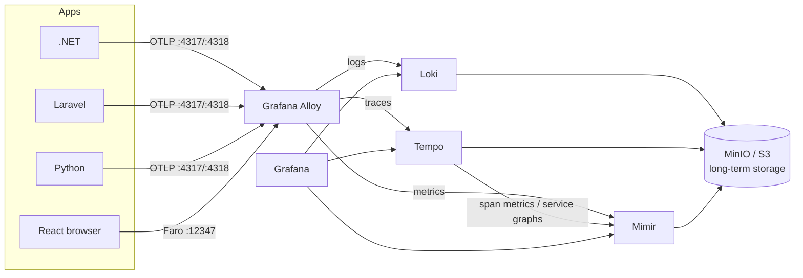

# Telemetries — Grafana observability stack

A flexible, vendor-neutral telemetry pipeline: applications emit
**OpenTelemetry** (OTLP), **Grafana Alloy** collects and routes,
**Loki / Tempo / Mimir** store logs / traces / metrics durably in object
storage, and **Grafana** queries everything with cross-signal
correlation (logs ⇄ traces ⇄ metrics).



## Quick start

```bash
cp .env.example .env    # change credentials for anything non-local
docker compose up -d
```

| Service | URL | Purpose |
|---|---|---|
| Grafana | http://localhost:3000 (admin/admin) | Query, dashboards, correlation |
| OTLP gRPC / HTTP | localhost:4317 / localhost:4318 | App telemetry ingest |
| Faro | http://localhost:12347/collect | Browser telemetry ingest |
| Alloy UI | http://localhost:12345 | Pipeline health |
| MinIO console | http://localhost:9001 | Object storage |

Point any example app at the stack (see below), then open Grafana →
**Explore** (Tempo/Loki/Mimir) or the provisioned **Service Overview
(RED)** dashboard. Trace-to-logs, trace-to-metrics, exemplars, and the
service map are pre-wired in the provisioned datasources.

## Example applications

Each example emits all three signals with trace-correlated logs:

| App | Directory | Approach |
|---|---|---|
| .NET (ASP.NET Core) | [`examples/dotnet`](examples/dotnet) | OpenTelemetry .NET SDK, OTLP gRPC |
| Laravel (PHP) | [`examples/laravel`](examples/laravel) | OTel PHP auto-instrumentation + Monolog OTLP handler |
| Python (FastAPI) | [`examples/python`](examples/python) | OTel Python SDK (manual + zero-code option) |
| React (browser) | [`examples/react`](examples/react) | Grafana Faro (errors, web vitals, sessions, traces) |

Backend apps only need two env vars to join the pipeline:

```bash
OTEL_SERVICE_NAME=my-service
OTEL_EXPORTER_OTLP_ENDPOINT=http://localhost:4317   # or http://alloy:4317 in-network
```

## Design decisions

- **Apps → Alloy only.** Applications never talk to storage backends;
  swapping/scaling backends requires zero app changes.
- **Object storage for everything.** Loki, Tempo, and Mimir all persist
  to S3-compatible storage (MinIO locally, S3/GCS/Azure in production),
  which is what makes long-term retention cheap. Retention: 90d logs,
  60d traces, 1y metrics — tune in each backend config.
- **Metrics outlive traces.** Tempo's metrics-generator derives RED
  metrics and service graphs from spans into Mimir, so latency/error
  trends survive long after raw traces expire.
- **Correlation by default.** Every example routes logs through the
  OTel bridge so `trace_id` is attached; Grafana datasources are
  provisioned with trace↔log↔metric links and exemplars.

## Repository layout

```
docker-compose.yml            # the whole stack
config/
  alloy/config.alloy          # collector pipeline (OTLP + Faro → backends)
  loki/loki.yaml              # logs (TSDB schema, S3, retention)
  tempo/tempo.yaml            # traces (S3, metrics-generator)
  mimir/mimir.yaml            # metrics (S3 blocks, 1y retention)
  grafana/provisioning/       # datasources with correlation + dashboards
examples/                     # .NET, Laravel, Python, React
docs/best-practices.md        # cardinality, sampling, security, scaling
```

See [docs/best-practices.md](docs/best-practices.md) before running this
anywhere real — it covers sampling, label cardinality, TLS/auth, data
scrubbing, and the scaling path to the distributed Helm deployments.
